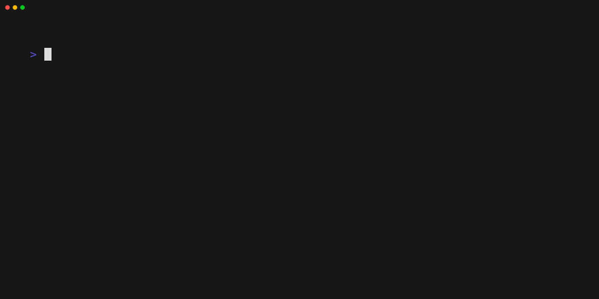

# contctrl

[](LICENSE)
[](https://golang.org)

A minimal, keyboard-driven control plane for managing Docker Compose projects at scale.



## Why

When you have dozens of Compose projects spread across a directory tree, jumping between them with plain shell commands becomes tedious. `contctrl` builds a catalog of all your projects and lets you navigate, select, and act on them through fuzzy finding — no typing full paths or service names.

## Features

- Fuzzy-find across all your Compose projects
- Select stacks and services interactively
- Run, stop, pull, and restart services with a single command
- Clean, minimal output that stays out of your way
- Raw Docker output streamed in real time

## Installation

**Requirements**

- Go 1.26+
- Docker with Compose plugin

```sh
git clone https://github.com/hanymamdouh82/contctrl.git
cd contctrl
make install
```

## Project Structure

`contctrl` expects a base directory containing your Compose projects. Each subdirectory is treated as a project and should include:

- One or more `*.yml` Compose files
- A `metadata.yml` file describing the project stacks and services

Example layout:

```
/mnt/repos/containerization/
├── myapp/
│   ├── docker-compose.yml
│   └── metadata.yml
├── monitoring/
│   ├── monitoring-dev.yml
│   ├── monitoring-prod.yml
│   └── metadata.yml
```

## Usage

```sh
contctrl run      # fuzzy select project > file > stack, then bring up services
contctrl stop     # fuzzy select project > file, then stop all services
contctrl pull     # fuzzy select project > file > stack, pull images and restart
contctrl restart  # fuzzy select project > stack, pull images
contctrl edit     # fuzzy select project > file > edit compose file
contctrl meta     # fuzzy select project > edit metadata file
contctrl config   # edit contctrl.yml file
```

All selection steps are interactive via fuzzy finder. If a project has only one Compose file, it is used automatically.

## Configuration

configuration file is located at `~/.config/contctrl.yml`. File is created automatically if doesn't exit on first run.

To edit config file:

```sh
contctrl config
```

## Dependencies

| Package                             | Purpose                     |
| ----------------------------------- | --------------------------- |
| `github.com/ktr0731/go-fuzzyfinder` | Interactive fuzzy selection |
| `github.com/fatih/color`            | Terminal color output       |

## License

MIT — see [LICENSE](LICENSE)
